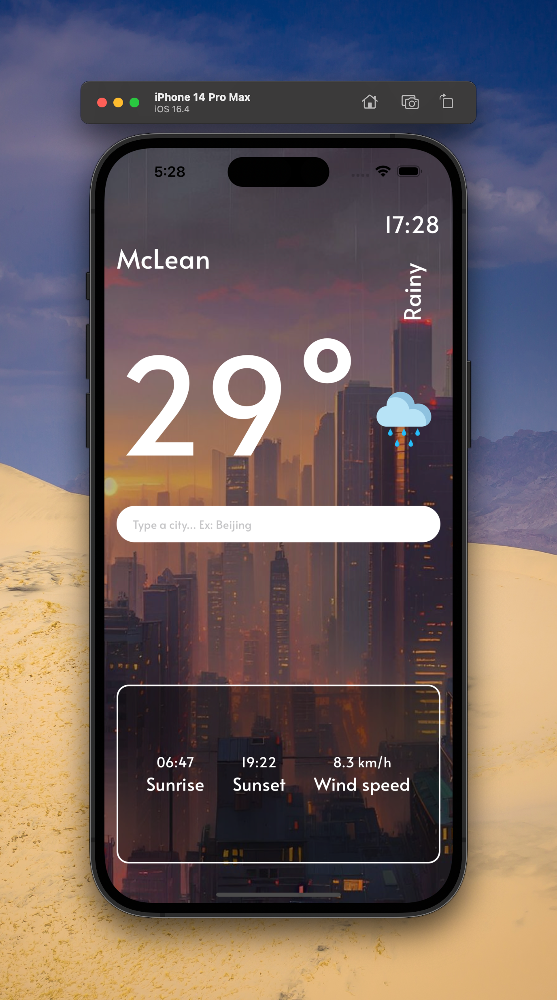
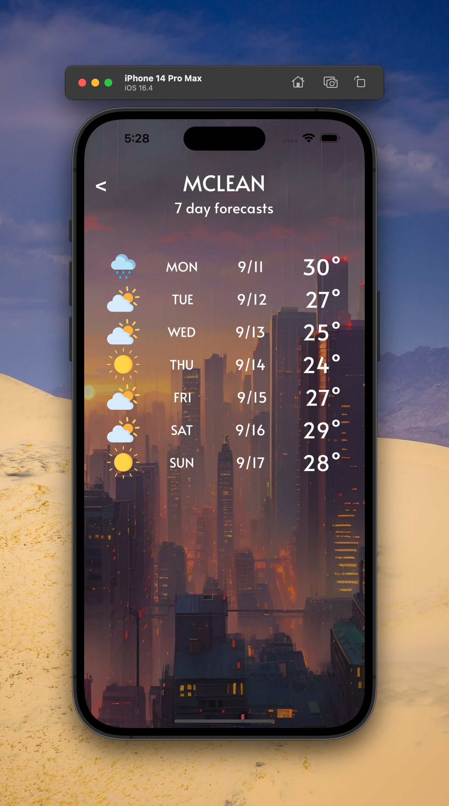

# 🌦 Weather React Native

A weather application built with React Native.

---

## 📖 Introduction

Weather React Native is an application developed using React Native that allows users to view real-time weather conditions and forecasts for the upcoming days.

---

## 🖼 Screenshots

<table>
<tr>
<td>
<strong> 🠠Home Page</strong> 

</td>

 
<td>
<strong> 🔮 Forecasts</strong> 

</td>
</tr>
</table>

